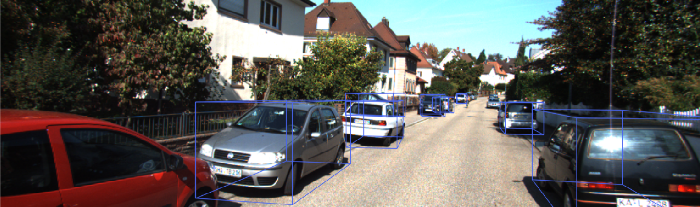

# ROS_Smoke

This repo deploys [SMOKE](https://github.com/open-mmlab/mmdetection3d/tree/master/configs/smoke) using TensorRT for C++ inference in ROS.

## 0.Prerequisites
- TensorRT 8.0.1 GA
- CUDA 10.2 (Additional patching required)
- See [install](https://github.com/lucastabelini/LaneATT#2-install)
- [MMDetection3D](https://github.com/open-mmlab/mmdetection3d/blob/master/docs/zh_cn/getting_started.md) (v1.0.0)
  ```bash
  pip install torch==1.8.0 torchvision==0.9.0
  pip install mmcv-full==1.4.0
  pip install mmdet==2.19.0
  pip install mmsegmentation==0.20.0
  git clone -b v1.0.0rc0 https://gitee.com/open-mmlab/mmdetection3d.git
  cd mmdetection3d
  pip install -v -e .  # or "python setup.py develop"
  ```

## 1.ONNX
1. Export ONNX (first comment [code](https://github.com/open-mmlab/mmdetection3d/blob/master/mmdet3d/models/dense_heads/smoke_mono3d_head.py#L107-L112) in `mmdet3d/models/dense_heads/smoke_mono3d_head.py`)
```bash
cd mmdetection3d
python smoke_pth2onnx.py  # smoke_dla34.onnx
```

## 2.TensorRT(C++/ROS  Inference)
```
git clone https://github.com/ChenZjut/ROS_Smoke.git
cd ROS_Smoke
catkin_make
roslaunch laneatt laneatt.launch
```



## 3.Reference
[tensorrt_smoke](https://github.com/storrrrrrrrm/tensorrt_smoke)

[TensorRT-SMOKE](https://github.com/Yibin122/TensorRT-SMOKE)

[mmdetection3d](https://github.com/open-mmlab/mmdetection3d)

[SMOKE](https://github.com/lzccccc/SMOKE)

## TODO
- [x] C++ inference
- [ ] Measure speed on Orin
